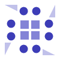

<!-- PROJECT LOGO -->
 

  
   
  <h3 align="center">PROJECTS</h3>
  

     
    <a href="https://github.com/kana800/myProjects/projects">View Progress</a>
    ·
    <a href="https://github.com/kana800/myProjects/issues">Report Bug</a>
    ·
    <a href="https://github.com/kana800/myProjects/issues">Request Feature</a>
  

This repository contains my answer/projects for the questions/projects given in the repositories listed below:

1. https://github.com/florinpop17/app-ideas
2. https://github.com/karan/Projects/

<h5 align="center">CODES IN THIS REPOSITORY MIGHT BE BUGGY USE IT AT YOUR OWN RISK</h5>

---

#### Overview

<table align="center">
  <tr>
    <th>Project Name</th>
    <th>Status</th>
  </tr>
  <tr>
    <td>Beginner</td>
    <td> 
       
    </td>
  </tr>
  <tr>
    <td>Karan's Project List</td>
    <td> 
       
    </td>
  </tr>
</table> 

#### Projects 

The list below contains all the projects from [florinpop17's](https://github.com/florinpop17/app-ideas) repo.

- [Beginner](1-Beginner)

The list below contains folder for the [karan's project](https://github.com/karan/Projects/).

- [Karan's project list solutions](karanprojects)

The list below contains projects from [project based tutorial in C](https://github.com/rby90/Project-Based-Tutorials-in-C) repo.

- [Project Based on C/C++](projectC)

This folder below contains several design patterns I implemented

- [Design Patterns](designpatterns)

#### Misc

- [CodingProblem/Exercises](CodingProblem)