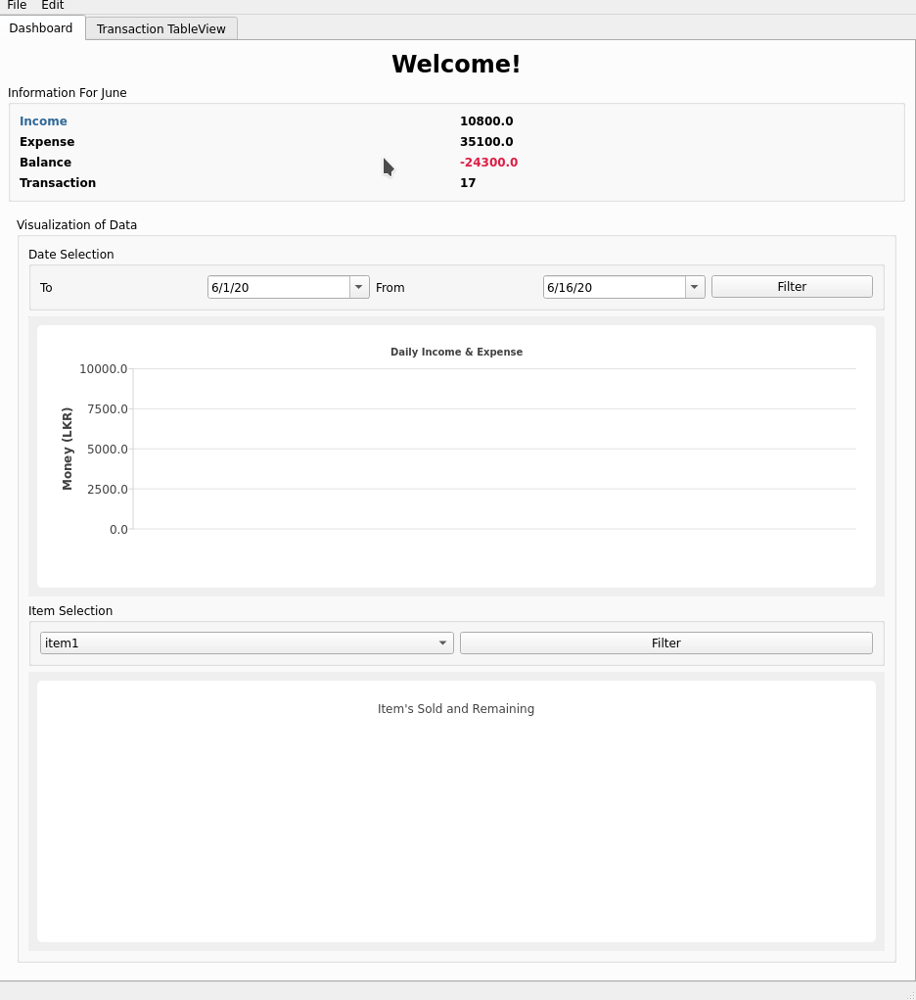

<br />
<p style="text-align: center" align="center">
  <a href="https://github.com/kana800/myProjects">
	:volcano:
  </a>
  <h3 align="center">Expense Tracker</h3>
  <p align="center">
    <br />
    <a href="https://github.com/kana800/myProjects/">Project List</a>
    ·
    <a href="https://github.com/kana800/myProjects/issues">Report Bug</a>
    ·
    <a href="https://github.com/kana800/myProjects/issues">Request Feature</a>
  </p>
</p>

### Desktop Based (Python)

This project is designed to keep in track of products and items for a small local business.

#### Preview

<p align="center">
	</img>
</p>

#### Usage

  * Clone the repository
  * Make sure that the **all** the packages in the `requirements.txt` are installed

```
python run.py
```
