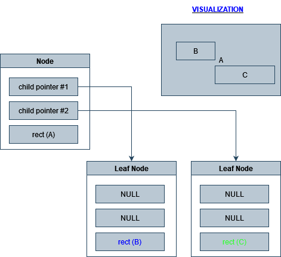
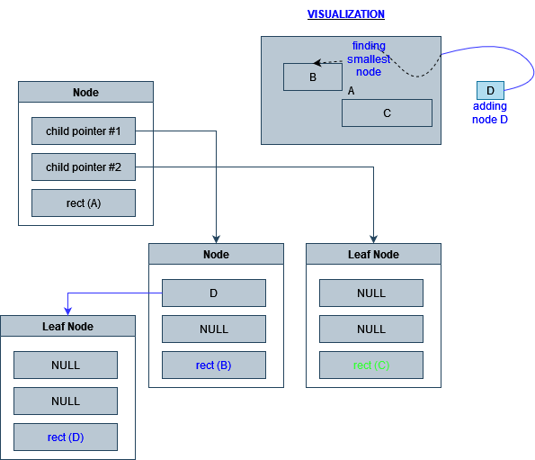
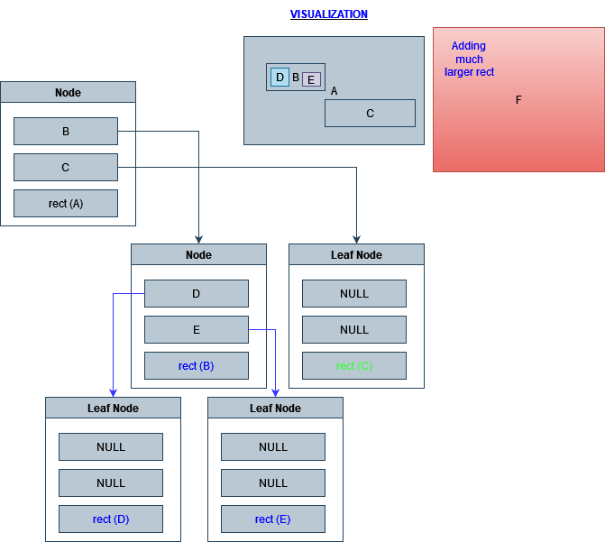
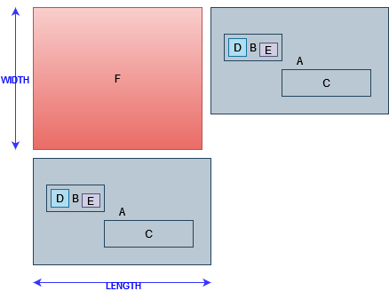
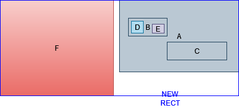

### What is an R-Tree?

> Its a dynamic index structure for spatial searching; *spatial-data* are objects that covers areas in multi-dimensional spaces. They can not be well represented by point locations.

> **R-Tree is a height balanced tree with index records in its leaf nodes (containting pointers to data objects)**

### R-Tree Index Structure

> A spatial database consists of a collection of tuples representing spatial objects.

The *leaf nodes* consist of: 
```
(I, tuple-identifier)
I = (I0,I1,...,In)
```
- entry index `I`: minimum bounding rectangle, `I`
    - `n` is the number of dimensions
    - `I0` would be `1` dimension; `I1` would be `[a,b]` a close bounded interval, that describes the extent of the object.

- tuple-identifier

The *non-leaf node* consist of: 
```
(I, child-pointer)
```
- `I` is the smallest rectangle that spatially contains all the rectangles/entries in the child node
- child-pointer is the address of a lower node in the *R-Tree*

Example:
```
(([1,2],[2,4]), L1)
```
The rectangle in the database will be identified as `L1`

The number of entries that fit in one node is maximum `M` and minimum `m`(`m <= M/2`).

### Properties of an R-Tree

> 1. Every leaf node contains between `m` and `M` index records unless it is the root.
> 2. All leaf nodes are at the same level.
> 3. Every non-leaf node has between `m` and `M` unless it is the root.
> 4. For each entry `(I, child-pointer)` in a non-leaf node, `I` is the smallest rectangle spatially contains the rectangles in a child node.


### Implementation of R-Tree

<p align="center"> <a href=""> Half Implementation On R-Tree </a></p>

This implementation is capable of 
- creating a rtree
- adding nodes to the rtree
- printing rtree

This implementation cannot do
- node splitting (most important part)

Check this implementation out: [R-Tree](https://github.com/tidwall/rtree.c/blob/master/rtree.c)

<details>
  <summary>Why Half Implementation</summary>
Sadly :disappointed: Don't have enough time.  
</details>

---

#### Object Creation

> Our R-Tree **consists of nodes which we'll be able to divide into leaves (containing key-value entries)** and 
branches containing many children - be it leaves or other branches.

Also we will be adding boolean value called `leaf` that will tell us whether `node` is a `leaf` or not. 

> while only leaf nodes contain the values, keys are present in both leaves and branches. 
However, branch keys (for our 2 dimensional space represented by rectangles) are describing so called 
**minimum bounding rectangle** (MBR) which is sufficient to cover all of the children keys stored 
within that parent.

```c
typedef struct node_ {
	char repr; // character representation of the node (tuple-identifier)
	bool leaf; // is it a leaf node
	struct rect_* rect; // rectangle that spatially contains all the entries;
	struct nodeentry_* childpointer; // holds the child pointers	
} node;
```

The `node` structure can be used as a `leaf` node or a `non-leaf` node; The `non-leaf` node will hold `childpointer`.

 - `struct rect_* rect` is the pointer that holds the `rect` object that spatially contains all the entries/child pointers;
```c
typedef struct rect_{
	double x0;
	double x1;
	double y0;
	double y1;
	double area;
}rect;
```
 - `struct nodeentry_* childpointer` contains pointer to the children nodes;

 ```c
 typedef struct nodeentry_ {
	node* ptr;
	node* nextchild;
}childpointer;
 ```

`r_tree` structure will hold data related to the tree data structure; `rootnode` will hold starting node;

```c
typedef struct r_tree {
	int height; // tracks the height of the tree
	node* rootnode; // pointer to root node
} rtree;
```

<p style="text-align: center" align="center">
  
  <p align="center">
	Visualization of the nodes
  </p>
</p>

#### Insertion

When inserting a `node` we need to find smallest rectangle node that can hold the object.
> we want to keep these minimum bounding rectangle... well, minimal. The smaller they remain, the less chance rectangles will overlap 
with others at the same level and more accurate they are. We can easily calculate that factor by taking the difference between surface areas of a current 
branch bounding rectangle and rectangle which would encapsulate inserted element.

When inserting value to the rtree first need to check whether a root node is available if it isn't then we need to 
**create** a rootnode. The root node will be `non-leaf` node.

> If the child nodes are full we need to split existing node in order for it to accommodate inserted leaf without violating max children capacity

#### Node Splitting

There are 3 algorithms presented by [Vlan Ag](https://youtu.be/Jd8F2hVnGtQ?t=499):
- Exhaustive Algorithm: 
	- Try all possible groupings and then
	choose the best one.
		- Requires knowledge of range or number
		of nearest neighbours
		- The number of possibilities is 
		approximately 
		- Has optimal results; Bad Run Time
- Quadratic-Cost Algorithm
	- Invoke `PickSeed` and assign two entries each to a group
		- For each pair of entries compose a rectangle and pick the one with largest `d`
	- Check if all entries are assigned
	- Else, invoke `PickNext` and assign the next entry for
	smallest rectangle. Resolve ties by adding the entry
	(to the group with smaller area, then to the one with fewer entries, then to either)
- Linear-Cost Algorithm
	- This is similar to the quadratic-cost algorithm; but we use a
	different version of `PickSeed`
		- Along each dimension find entry whose rectangle
		has the highest low side, and the one with lowest high side. 
		Record the separation `L`. 
		- Normalize the separations by the widith of the entire
		set along the corresponding dimensions `W`
		Choose the pair with the greatest normalized separation `L/W`

In the function `getCompatibleChildNode` we are getting the most compatible child node for the provided `rect` value. We are simply comparing the
`area` of the `childnode` against the `area` of the `rect`. 
- What should I do when both area of childnode and area of rect are equal
- What should I do if all the area's of childnode are lower than provided `rect`
- What should I do if the provided area of `rect` is smaller than the area of childnode.

We only hold `2` childnode's maximum (`M=2`), For the last point we can just find the smallest possible childnode that can occupy the
`rect`;
The next question will be how we are going to do the *node splitting*, 
I can make a `leaf node` with the smallest `rect` and add to the **childnode** of the **selected node**. 

<p style="text-align: center" align="center">
  
  <p align="center">
	Visualization of adding nodes
  </p>
</p>

If we adding a node that is bigger than the a *childnode* or *node* in general

<p style="text-align: center" align="center">
  
  <p align="center">
	Visualization of adding bigger node
  </p>
</p>

we can compare the sizes with the largest node and expand the `rect`

<p style="text-align: center" align="center">
  
  <p align="center">
	Visualization of adding bigger node pt1
  </p>
</p>

<p style="text-align: center" align="center">
  
  <p align="center">
	Visualization of adding bigger node pt2
  </p>
</p>

---


### References

- [R-Tree by Vlan Ag](https://www.youtube.com/watch?v=Jd8F2hVnGtQ)
- [R-Tree Slides](https://www2.cs.sfu.ca/CourseCentral/454/jpei/slides/R-Tree.pdf)
- [RTree Wikipedia](https://en.wikipedia.org/wiki/R-tree)
- [Implementation on R-Tree](https://github.com/tidwall/rtree.c/blob/master/rtree.c)
- [Blog about R-Tree](https://bartoszsypytkowski.com/r-tree/)
