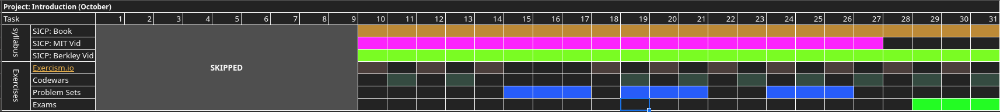

> start date: 2021/10/09

### Syllabus

> The below lessons/courses will be covered in the month of october.

#### Main Course

- [Structure and intepretation of computer programs](https://teachyourselfcs.com/#programming) | [notes](notes.md) | [MIT Videos](https://ocw.mit.edu/courses/electrical-engineering-and-computer-science/6-001-structure-and-interpretation-of-computer-programs-spring-2005/video-lectures/)
- [Programming Languages A, B & C](https://github.com/ossu/computer-science#core-programming)

#### Extra Readings

- [How to Design Programs](https://htdp.org/2003-09-26/Book/curriculum-Z-H-1.html)

#### Other

- [Introduction to Cpp](introductiontocpp)

### Log

- 2021/10/09: Read the book SCIP until chapter `1.1.6` 
- 2021/10/12: Completed the Chapter `1.1.x` in SCIP Book & MIT Video `1A`
- 2021/10/13: Completed Exercise 1.1, 1.2 & 1.3.
- 2021/10/14: Completed the first segment of the Lecture `1B`
- 2021/10/16: Completed lecture `1B`
	- Completed Exercise 1.5 - 1.8
	- Completed Introduction topic in `introduction to Cpp` course
- 2021/10/17: Completed FlowOfControl topic in `introduction to Cpp` course
	- Started on `introduction/Problem Set #1`
